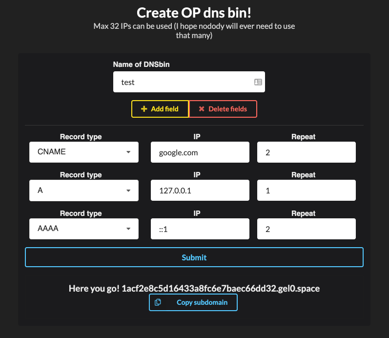
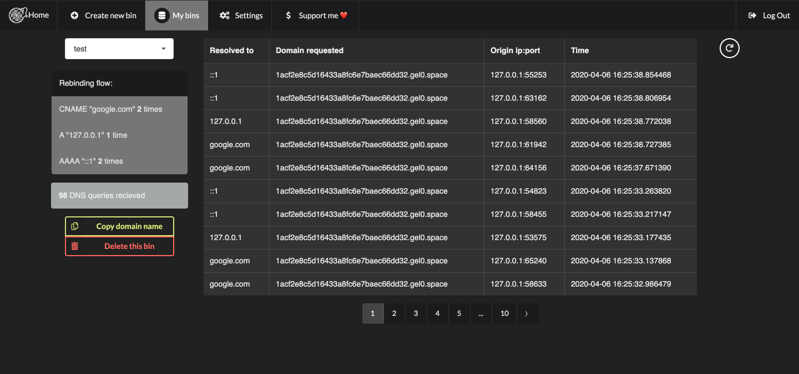

# DNSfookup v 2.1.0 - 2025 Update oringinal https://github.com/makuga01/dnsFookup
[DNS Rebinding](https://en.wikipedia.org/wiki/DNS_rebinding) freamwork containing:
 - a dns server obviously
 - python web api to create new subdomains and control the dns server, view logs, stuff like that
 - shitty react app to make it more comfy

 [Changelog](./CHANGELOG.md)
 
 [API documentation](./API.md)

## What does it do?
It lets you create dns bins like a burp collaborator
but it adds a bit more features...


You can specify what ips/domains should the created subdomain resolve to and how many times, for now it *A,CNAME and AAAA record are supported*

Then you can see where it was requested from, what did it resolve to,... in logs



### Video of tool in action

[](https://youtu.be/jP_bFUdDVRQ)

Source of the vulnerable application is from https://github.com/makuga01/dnsFookup/tree/master/vulnerableApp

## 🚀 Quick Start (2025 Update)

### Prerequisites
- Python 3.9+ 
- Node.js 18+
- Docker & Docker Compose
- Git

### Easy Migration from Old Version
```bash
# Run the migration script
python3 migrate_to_2025.py
```

### Manual Installation
```bash
# 1. Clone and configure
git clone https://github.com/your-username/dnsFookup.git
cd dnsFookup
vim config.yaml  # Update passwords and secrets!

# 2. Start services
docker-compose up -d

# 3. Setup backend
cd BE
python3 -m venv venv
source venv/bin/activate  # Windows: venv\Scripts\activate
pip install -r requirements.txt

# 4. Initialize database
python3 -c "from app import app, db; app.app_context().push(); db.create_all()"

# 5. Setup frontend
cd ../FE
npm install
# Edit src/config.js for your domain

# 6. Run the application
# Terminal 1: DNS Server (requires sudo)
cd BE && sudo python3 dns.py

# Terminal 2: API Server
cd BE && flask run

# Terminal 3: Frontend
cd FE && npm start
```

📖 **Documentation**:
- **Development Setup**: [INSTALL_2025.md](./INSTALL_2025.md)
- **Production Deployment**: [PRODUCTION_SETUP.md](./PRODUCTION_SETUP.md)
- **Cloudflare Configuration**: [CLOUDFLARE_SETUP.md](./CLOUDFLARE_SETUP.md)

## 🚀 Production Quick Deploy

For production deployment with your own domain:

```bash
# 1. Clone project pada VPS
git clone https://github.com/your-username/dnsFookup.git
cd dnsFookup

# 2. Run automated deployment (with smart dependency checking)
chmod +x deploy.sh
./deploy.sh rebind.com 45.67.67.55

# 3. Configure Cloudflare DNS (see CLOUDFLARE_SETUP.md)

# 4. Check versions and status
chmod +x check_versions.sh
./check_versions.sh rebind.com

# 5. Test deployment
chmod +x test_deployment.sh
./test_deployment.sh rebind.com 45.67.67.55
```

### 🔧 Smart Deployment Features:
- **Dependency Detection**: Checks existing installations (Node.js, Python, Docker, etc.)
- **Version Validation**: Ensures compatible versions (Node.js 18+, Python 3.9+)
- **Incremental Updates**: Only installs missing components
- **Service Management**: Detects running services and avoids conflicts
- **SSL Certificate Management**: Checks expiry and renews when needed
- **Database Persistence**: Preserves existing data during updates

### Example Production URLs:
- **Frontend**: https://app.rebind.com
- **API**: https://api.rebind.com  
- **DNS Server**: ns.rebind.com (45.67.67.55:53)
- **DNS Rebinding**: *.dns.rebind.com

## ✨ What's New in v2.1.0 (2025 Update)

### 🔧 Backend Updates
- **Flask 3.1.1**: Modern Flask with updated patterns and security
- **Python 3.9+ Support**: Compatible with latest Python versions
- **SQLAlchemy 2.0**: Latest ORM with improved performance
- **Flask-JWT-Extended 4.6**: Updated authentication system
- **Updated Dependencies**: All packages updated to 2025 versions

### ⚛️ Frontend Updates  
- **React 18**: Latest React with concurrent features
- **React Router v6**: Modern routing patterns
- **Semantic UI React 2.1**: Updated component library
- **Modern Build Tools**: React Scripts 5.0

### 🐳 Infrastructure Updates
- **Docker Compose 3.8**: Modern container orchestration
- **PostgreSQL 16**: Latest database version
- **Redis 7.4**: Updated caching layer
- **Health Checks**: Better service monitoring

### 🛡️ Security Improvements
- **Updated Authentication**: Modern JWT patterns
- **Dependency Updates**: Security patches included
- **Better Error Handling**: Improved error management

### 🔄 Migration Support
- **Automated Migration**: `migrate_to_2025.py` script
- **Backward Compatibility**: Existing data preserved
- **Configuration Updates**: Guided config migration

*If you have a bit of free time, please contribute, it means a lot to me :D*

#### Want to see some feature in next update?

Let me know [on keybase](https://keybase.io/gel0)
